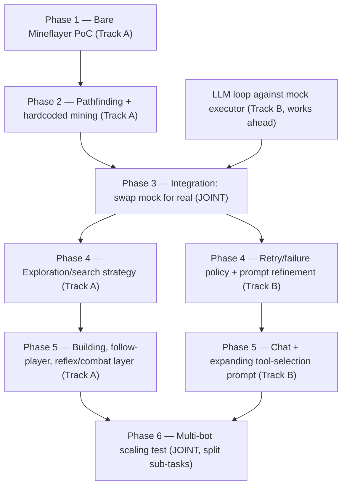

# Phase Plan and Parallel Work Split — Minecraft AI Agent

Detailed breakdown of Phases 1–6, written for **two people working in parallel**. Two tracks run independently for most of the project and merge at a few clearly marked points — the goal is that neither person sits idle waiting on the other.

---

## The one thing to agree on before splitting

Both tracks need to build against the **same executor interface** from the start — this is what makes parallel work possible at all, because Track B can build the whole planning loop without a real Minecraft connection, using a fake stand-in that just returns made-up data.

```ts
// Shared contract — agree on this together first, then work independently against it

interface BotExecutor {
  moveTo(coords: {x, y, z}): Promise<Result>
  mineBlock(blockType: string, maxDistance: number): Promise<Result>
  placeBlock(blockType: string, position: {x, y, z}): Promise<Result>
  followPlayer(playerName: string): Promise<Result>
  attack(entityId: string): Promise<Result>
  flee(): Promise<Result>
  chat(message: string): void
  getState(): {
    position, inventory, nearbyBlocks, nearbyEntities, health
  }
}
```

- **Track A** implements this for real, against Mineflayer.
- **Track B** builds the LLM planning loop against a **mock** `BotExecutor` — one that just logs what was called, or returns canned fake state (e.g. "there's coal ore 5 blocks north"). No live server connection needed to make real progress.
- They merge by swapping the mock for the real implementation. If both sides held to the interface, this is a small integration step, not a rewrite.

## Dependency graph



---

## Phase 1 — Bare Mineflayer PoC (Track A only)

**Owner:** Track A. **Blocked by:** nothing (Phase 0 is done). **Does not block Track B** — see the parallel LLM-loop work below, which can start on day one.

- Set up a Node project, install `mineflayer`.
- Script logs the bot into the dev server, reads its own position and inventory on login, and walks to one fixed hardcoded coordinate using raw bot movement (no pathfinding plugin yet).
- **Deliverable:** a bot that connects, prints its state, and reaches a fixed point.
- **Verification:** watch it happen in-game from a second player connection, and confirm the printed state matches reality.

## Phase 2 — Pathfinding + hardcoded mining (Track A only)

**Owner:** Track A. **Blocked by:** Phase 1.

- Add `mineflayer-pathfinder`.
- Path to a known coal-ore coordinate (hardcode it — you know where one is from playing) and mine it.
- **Deliverable:** bot navigates around obstacles (not just a straight line) and successfully mines a targeted block.
- **Verification:** confirm the block is actually gone and the item lands in the bot's inventory.

## Meanwhile — Track B works ahead (parallel with Phases 1 & 2)

**Owner:** Track B. **Blocked by:** nothing — this is the whole point of the mock interface above.

- Set up the Ollama client call (local REST API).
- Design the prompt/tool schema: how game state gets serialized into text the model sees, and the exact JSON action format the model must emit (e.g. `{"action": "mine", "target": "coal_ore"}`).
- Build the parsing/validation layer: take the model's raw text output, extract and validate the JSON, reject or retry on malformed output.
- Test this whole loop against the **mock** `BotExecutor` — feed it fake states ("you see coal ore 5 blocks north, health full, inventory empty") and confirm the model reliably emits valid, schema-correct actions.
- **Deliverable:** a script that takes a fake game state and produces a validated action, with zero dependency on a live Minecraft connection.
- **Verification:** run it against a handful of made-up scenarios (empty inventory, low health, target not visible) and confirm the output is always parseable and reasonable.

## Phase 3 — Integration (JOINT — do this one together)

**Owner:** both. **Blocked by:** Phase 2 AND the Track B parallel work above.

- Swap Track B's mock executor for Track A's real Mineflayer-backed one.
- This is the first point where the two halves of the codebase actually touch — interface mismatches (a param name that drifted, a return shape that doesn't match) surface here, which is why it's worth doing as a pair session rather than split further.
- **Deliverable:** the full loop — real game state → LLM decision → real game action — closes at least once, end to end.
- **Verification:** tell the bot to mine a specific, visible block by name and watch it actually do it via the LLM's decision, not a hardcoded call.

## Phase 4 — Reliable "find and mine coal" (splits again)

**Blocked by:** Phase 3.

- **Track A:** the exploration/search strategy. Coal isn't always in already-loaded chunks, so "find" needs real logic — spiral outward, check exposed cave openings, dig down as a fallback. This is plain game-logic code, independent of the LLM.
- **Track B:** the retry/failure policy and prompt refinement. What should the agent do when a search comes up empty? When does it escalate, retry with a wider radius, or give up and report back? This is prompt/decision-logic work, independent of the search algorithm's internals.
- These touch different layers (game logic vs. decision logic) and can genuinely run in parallel — the merge is just "run them together and see if the whole thing behaves" once both are ready.

## Phase 5 — Generalize to full toolbox (4 independent additions, split 2-and-2)

**Blocked by:** Phase 4 (or can start once Phase 3's integration is solid, if you don't want to wait on Phase 4's polish).

**Track A (game execution — do in any order, fully independent of each other):**
- Building from a blueprint/schematic — new `placeBlock` usage plus a simple schematic loader (a saved list of block-type + relative-position pairs to place in sequence).
- Follow-player — a thin wrapper around the pathfinder that continuously re-targets a player's position. Genuinely trivial; good pick if someone wants a quick win.
- Reflex/safety layer for combat — a small, **completely standalone** piece of plain code (per [Architecture and Approach](./Architecture%20and%20Approach.md)) that watches health and nearby hostile mobs and can interrupt whatever the LLM is doing. Doesn't touch the LLM code at all, so it's a good "work totally independently start to finish" pick.

**Track B (agent/LLM side):**
- Chat integration — LLM generates in-character responses to nearby player chat messages.
- Expanding the tool-selection prompt/schema as each Track A tool lands, and verifying the model still picks correctly from a growing menu of actions (a bigger toolbox is a real test of whether a 14B-class model stays reliable at tool selection — worth tracking failures here).

## Phase 6 — Multi-bot scaling test (JOINT, but splits into 2 live sub-tasks)

**Blocked by:** Phase 5 (or at least a stable single-bot version).

This phase is less "independent work finishing separately" and more a live test session where you're each watching a different half of the same run:
- **One person:** Ollama-side tuning — set `OLLAMA_NUM_PARALLEL`, watch request queueing/latency as load increases (see [Hardware and Feasibility](./Hardware%20and%20Feasibility.md)).
- **Other person:** bot-side orchestration — spin up 2+ bot client processes, give them different standing instructions, watch for behavior conflicts (two bots claiming the same block, colliding, etc.).

## Suggested track assignment

No inherent reason either person has to take a specific track — pick by interest. Track A leans "Minecraft/game mechanics," Track B leans "prompting/LLM behavior." Both are equally learnable from scratch, so let interest decide rather than assuming a split.
